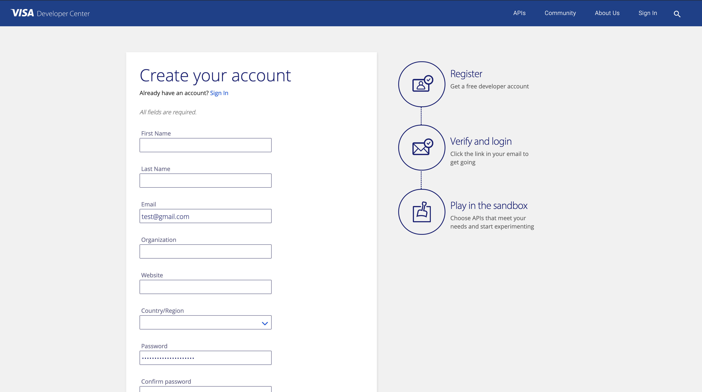
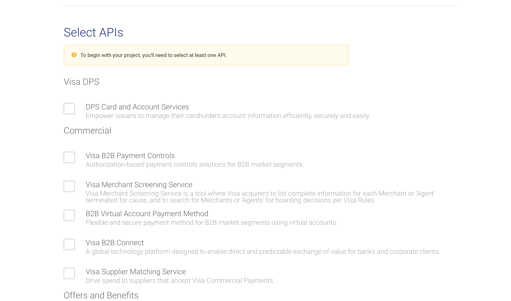
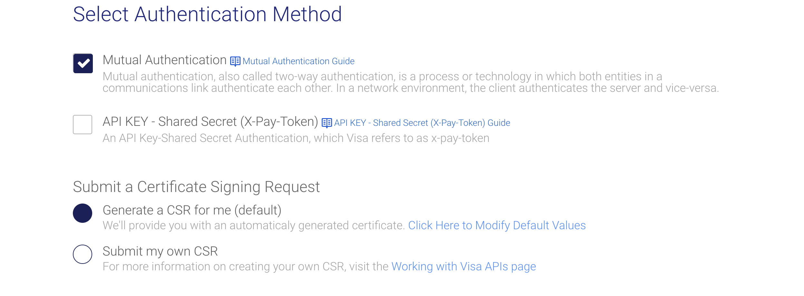
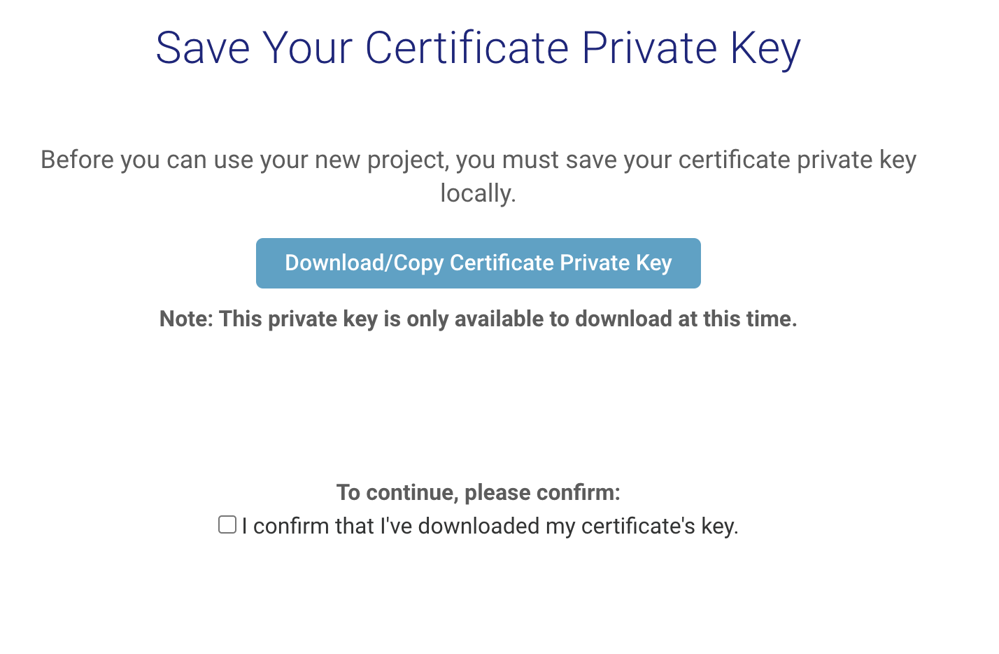
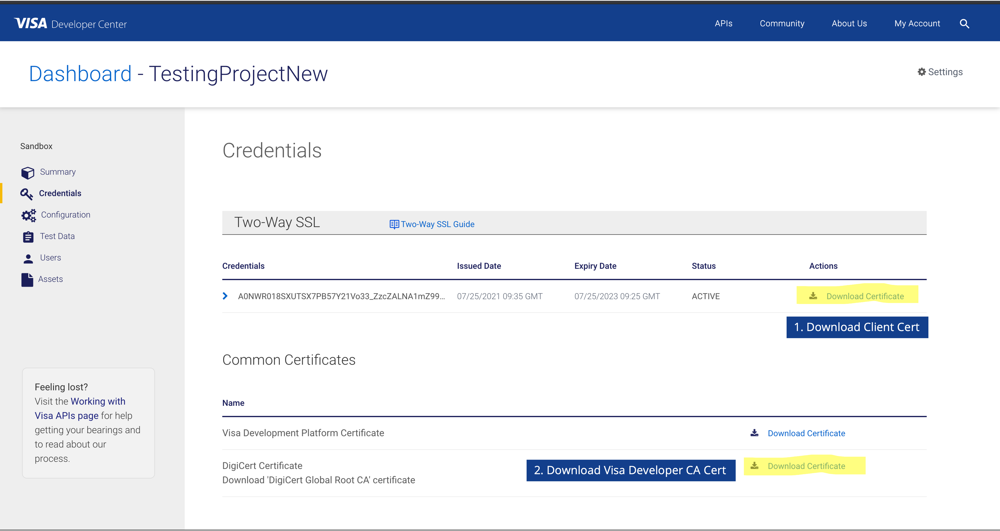
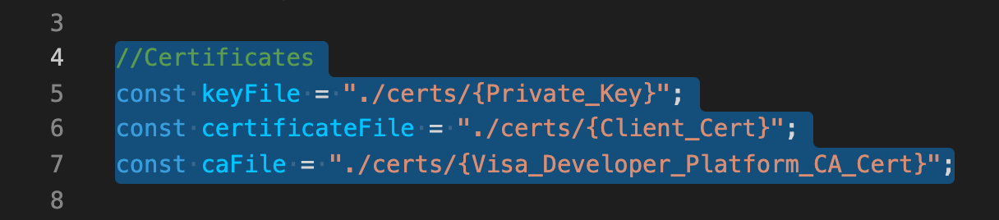
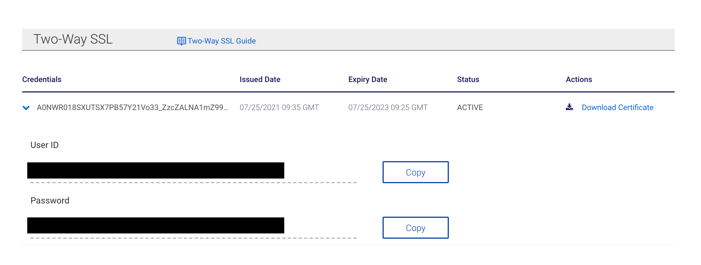

# Visa Developer Platform Sandbox Sample Project
This project is created using Nodejs and Express library and it allows you to send request to Visa Developer Platform's Sandbox API(s). Users are expected to create an Visa Developer Account and project to configure the credentials in this project. 

You can import the Postman Collection into your Postman to test some of the sandbox Urls. Configure your postman by following this instructions: https://developer.visa.com/pages/working-with-visa-apis/two-way-ssl#testing_twoway_ssl_connectivity_using_postman 

# Creating Visa Developer Account
1. Create a Visa Developer Account here:
https://developer.visa.com/identity/user/register

    
2. Create a New Project

3. Select the APIs you are going to use
You can select everything if you are not sure what you would be using yet.

4. Select Authentication Method
Select Mutual Authentication (Default selection) and select Generate a CSR for me (default). If you would prefer to submit your own CSR, you can do so as well.

5. Download Private Key
The next step after creating a new project is to download the private key. You MUST download the private key at this page as this is the only time you will be able to do so for the project.

6. Download Certificates
Navigate to Credentials in the side menu and download the Client Certificate and Visa Developer Platform CA Certificate
   
The CA Certificate has to be converted to .pem extensions before it can be used.  
For Windows: https://help.teradici.com/s/article/1147  
For Mac/Linux: https://perrohunter.com/how-to-convert-a-cer-certificate-to-pem-on-linuxunix-and-os-x/   
Move these Certificates into the project directory and update their file path in config.js   

7. Copy User Details
Copy User ID and password from Credential page and update config.js

8. Run the Node Js project and test the API!
http://localhost:3000/banks/12345678 (Don't forget to run npm install to install the libs as well)